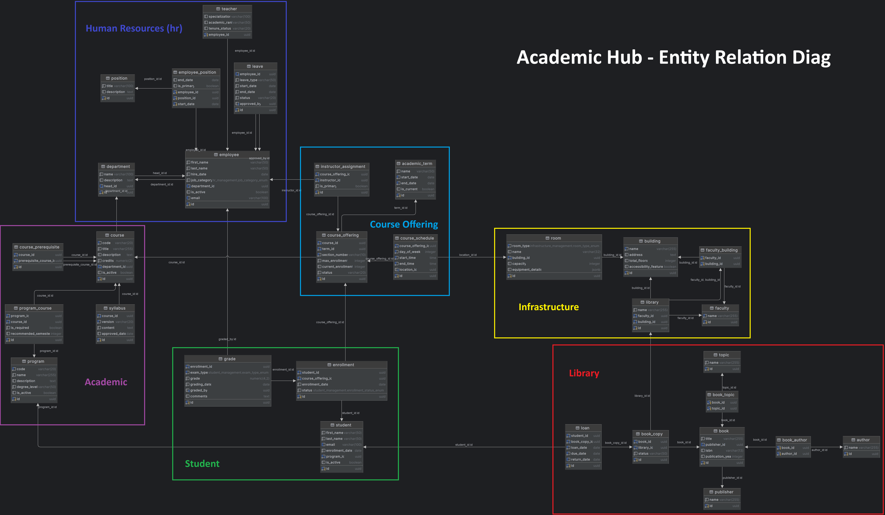

<h1 align="center">
   
   <div align="center">Academic Hub</div>
</h1>

<p align="center">
  <a href="https://github.com/Yrrrrrf/academic-hub">
    
  </a>
  <a href="./LICENSE">
    
  </a>
  
</p>

<p align="center">
  A comprehensive Desktop + Web application for managing critical data in academic institutes.
</p>

## Features

- **Comprehensive Data Management**: Handle student records, course information, faculty details, and more.
- **Real-time Updates**: Utilize PLpgSQL real-time capabilities for instant data synchronization.
- **Cross-platform Compatibility**: Access the system via web browsers or as a desktop application.
- **Scalable Architecture**: Designed to handle large volumes of data efficiently.
- **User-friendly Interface**: Intuitive design using DaisyUI for enhanced user experience.
- **Secure Authentication**: Implement role-based access control for data protection.
- **Reporting and Analytics**: Generate insightful reports on various academic metrics.

## Tech Stack

- **Backend**:
    - [FastAPI](https://www.python.org/) for backend development
    - [PostgreSQL](https://www.postgresql.org/) for robust data storage
- **Frontend**:
    - [SvelteKit](https://kit.svelte.dev/) for efficient web development
    - [DaisyUI](https://daisyui.com/) for responsive and attractive UI components
- **Desktop Application**:
    - [Tauri](https://tauri.app/) for cross-platform desktop development

## Installation

### Docker Installation (Recommended)

1. Clone the repository:
```bash
git clone https://github.com/Yrrrrrf/academic-hub.git
cd academic-hub
```

2. Create a `.env` file in the project root with the following content:
```bash
# * db credentials
POSTGRES_DB="academic_hub"
POSTGRES_USER="academic_hub_owner"
POSTGRES_PASSWORD="some_secure_password"

# * db schema passwords
PASSWORD_INFRASTRUCTURE="infra_password"
PASSWORD_HR="hr_password"
PASSWORD_ACADEMIC="academic_password"
PASSWORD_COURSE_OFFERING="course_offering_password"
PASSWORD_STUDENT="student_password"
PASSWORD_LIBRARY="library_password"
```

3. Build and start the Docker containers:
```bash
docker-compose up --build
```

### Local Installation

For step-by-step instructions on how to set up the project locally without Docker, please refer to our [Local Installation Guide](./resources/local-installation.md).

## Usage
- Access Web interface: http://localhost:5173
- Check API docs: http://localhost:8000/docs

## Database Schema

Our database schema is designed to efficiently manage academic data. 
Including the separation in some schemas that help to organize the data in a more structured way.



This separation allows for better organization and management of data.

## Contributing

We welcome contributions to Academic Hub! Please follow these steps to contribute:

1. Fork the repository
2. Create a new branch: `git checkout -b feature/your-feature-name`
3. Make your changes and commit them: `git commit -m 'Add some feature'`
4. Push to the branch: `git push origin feature/your-feature-name`
5. Submit a pull request

Please read our [Contributing Guide](CONTRIBUTING.md) for more details.

## License

This project is licensed under the MIT License - see the [LICENSE](LICENSE) file for details.
