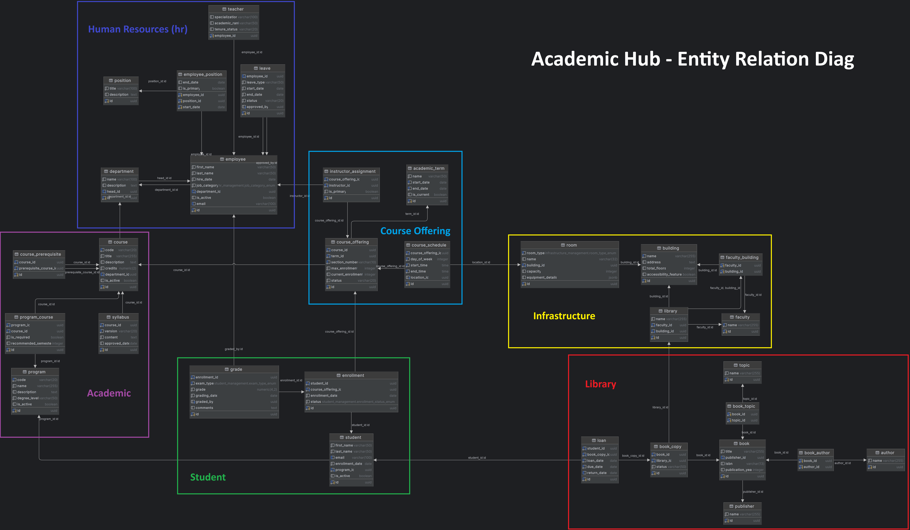

<h1 align="center">
   
   <div align="center">Academic Hub</div>
</h1>

<p align="center">
  <a href="https://github.com/Yrrrrrf/academic-hub">
    
  </a>
  
  
</p>

<p align="center">
  A comprehensive Desktop + Web application for managing critical data in academic institutes.
</p>

## Table of Contents

- [Features](#features)
- [Technology Stack](#technology-stack)
- [Getting Started](#getting-started)
    - [Prerequisites](#prerequisites)
    - [Installation](#installation)
- [Usage](#usage)
- [Database Schema](#database-schema)
- [API Documentation](#api-documentation)
- [Contributing](#contributing)
- [License](#license)

## Features

Academic Hub offers a robust set of features designed to streamline academic data management:

- **Comprehensive Data Management**: Handle student records, course information, faculty details, and more.
- **Real-time Updates**: Utilize PLpgSQL real-time capabilities for instant data synchronization.
- **Cross-platform Compatibility**: Access the system via web browsers or as a desktop application.
- **Scalable Architecture**: Designed to handle large volumes of data efficiently.
- **User-friendly Interface**: Intuitive design using DaisyUI for enhanced user experience.
- **Secure Authentication**: Implement role-based access control for data protection.
- **Reporting and Analytics**: Generate insightful reports on various academic metrics.

## Technology Stack

- **Backend**:
    - [Supabase](https://supabase.io/) for database and API
    - PostgreSQL for robust data storage
- **Frontend**:
    - [SvelteKit](https://kit.svelte.dev/) for efficient web development
    - [DaisyUI](https://daisyui.com/) for responsive and attractive UI components
- **Desktop Application**:
    - [Tauri](https://tauri.app/) for cross-platform desktop development

## Getting Started

### Prerequisites

Before you begin, ensure you have the following installed:

- [Node.js](https://nodejs.org/) (v14 or later)
- [npm](https://www.npmjs.com/) or [yarn](https://yarnpkg.com/)
- [Rust](https://www.rust-lang.org/) (for Tauri desktop app development)
- [PostgreSQL](https://www.postgresql.org/) (v12 or later)

[//]: # (VITE_SUPABASE_URL=your_supabase_project_url)

[//]: # (VITE_SUPABASE_ANON_KEY=your_supabase_anon_key)

### Installation

1. Clone the repository:
   ```
   git clone https://github.com/yourusername/academic-hub.git
   cd academic-hub
   ```

2. Install dependencies:
   ```
   npm install
   ```

3. Set up your Supabase project and update the configuration in `src/lib/supabase.ts`.

4. Run the development server:
   ```
   npm run dev
   ```

5. For desktop app development, install Tauri CLI:
   ```
   npm install -g @tauri-apps/cli
   ```

## Usage

- Access the web application at `http://localhost:5173`. (Port may vary based on your configuration)
- To run the desktop application:
  ```
  npm run tauri dev
  ```

## Database Schema



Our database schema is designed to efficiently manage academic data.

Key features include the separation in some schemas for different types of data, such as:
- Infrastructure
- Library
- School (Academic)
- Authentication

This separation allows for better organization and management of data.  Additionally, we have implemented relationships between tables to ensure data integrity and consistency.

For a detailed view of the schema, please refer to the image above.

## API Documentation

API documentation is available at `/api/docs` when running the development server. It provides detailed information about available endpoints, request/response formats, and authentication requirements.

## Contributing

We welcome contributions to Academic Hub! Please follow these steps to contribute:

1. Fork the repository
2. Create a new branch: `git checkout -b feature/your-feature-name`
3. Make your changes and commit them: `git commit -m 'Add some feature'`
4. Push to the branch: `git push origin feature/your-feature-name`
5. Submit a pull request

Please read our [Contributing Guide](CONTRIBUTING.md) for more details.

## License

This project is licensed under the MIT License - see the [LICENSE](LICENSE) file for details.